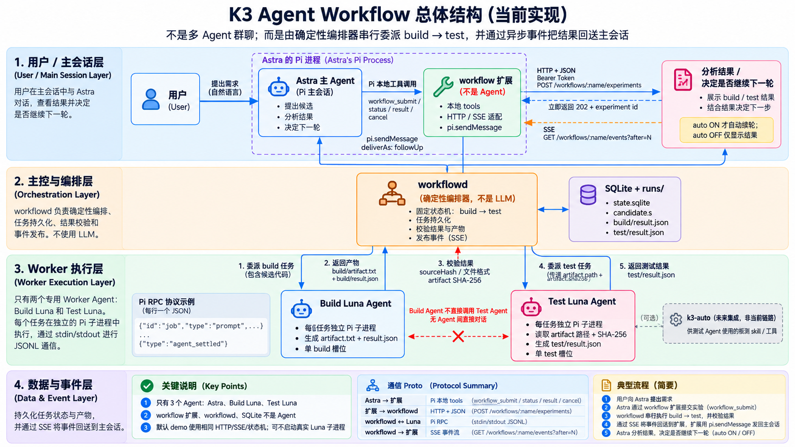

# K3 Agent Workflow

为 Pi 编写的轻量异步编排 MVP：**主 Agent 提交任务 → Build Luna → Test Luna → 结果回传**。



> 图示为组件关系参考；当前全局只有一个活动 Worker，按 Build → Test 顺序执行。通信细节见[架构说明](docs/overview.md)。

## 当前能做什么

- **模拟闭环**：无需模型或开发板，验证任务提交、阶段交接和完成通知。
- **只读预演**：Build Luna 阅读 Linux 构建资料，Test Luna 使用 `k3-auto` skills，返回两份计划。

**默认路径不编译、不访问板卡。** 模拟结果标记 `simulated: true`；预演标记 `mode: "plan-only"`。另有须明确授权的[单次真实执行入口](docs/real-run.md)，使用现有 `.config` 构建 Image 并跑一轮 UnixBench。

`workflowd` 是本项目的 TypeScript 后台服务，不是第三方工作流框架，也不是额外 Agent。

## 快速验证

要求 **Node.js 24+**，在仓库根目录运行，无需安装依赖或构建：

```bash
node scripts/demo.ts
node --test tests/*.test.ts
```

Demo 完成一次模拟 Build → Test → SSE 通知并清理临时数据；以上命令不调用模型、不访问硬件。

要接入主 Pi，请看[使用指南](docs/usage.md)；要验证 Linux → k3-auto，请看[只读预演指南](docs/plan-only.md)。真实模型调用须显式开启，自动续轮默认关闭。

## 文档

| 文档 | 内容 |
|---|---|
| [使用指南](docs/usage.md) | 启动服务、加载扩展、命令、日志与故障恢复 |
| [只读预演](docs/plan-only.md) | Luna 配置、k3-auto skills、单次实验与权限边界 |
| [架构与协作](docs/overview.md) | 角色分工、组件来源、协作图与时序图 |
| [设计](docs/design.md) / [通信协议](docs/communication.md) | MVP 约束、状态机、接口与消息契约 |
| [验证记录](docs/verification.md) / [只读预演](docs/experiments/linux-k3-plan-smoke.md) | 自动化覆盖、规划实验与限制 |
| [真实 Build/UnixBench 实验](docs/experiments/linux-k3-csrrsi-fast-real.md) | CSRRSI FAST + PTP 当前配置的真实结果与证据索引 |
| [开发维护](docs/development.md) | 测试范围、图稿生成与源码位置 |
