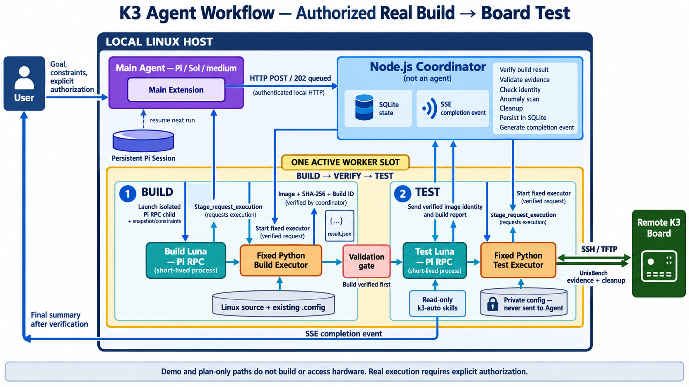

# K3 Agent Workflow

为 Pi 提供轻量异步实验编排：**User → Main Agent → Coordinator → Build → Test → 已验证结果**。



> 图示展示明确授权的真实 Build → Board Test 流程。默认 demo/plan-only 不编译、不访问硬件。

## Quick Start：在 Pi 对话中触发一次模拟 workflow

### 1. 启动本地 Coordinator（终端 A）

```bash
cd /path/to/k3-agent-workflow
node src/cli.ts serve
```

默认只启用安全的模拟 profile，监听 `127.0.0.1:43127`。保持终端运行。

### 2. 新开一个 Pi Agent（终端 B）

将路径替换为仓库实际位置：

```bash
cd /path/to/k3-agent-workflow
export K3_WORKFLOW_URL=http://127.0.0.1:43127
export K3_WORKFLOW_TOKEN_FILE="$PWD/.workflow/token"
pi --model openai-codex/gpt-6.1-sol \
  --extension "$PWD/extension/index.ts"
```

此示例使用 `gpt-6.1-sol`；请确保 Pi 已配置该模型的认证，也可替换为本机已配置的模型。在新 Pi 会话中先连接 workflow：

```text
/workflow attach asm-demo
```

然后用自然语言主动触发一次任务：

```text
请调用 workflow_submit 发起一次模拟实验：
key 使用 quickstart-001，candidate 使用 ".text\nret\n"，
hypothesis 为“验证异步 Build → Test 交接”。提交后不要反复轮询，等待完成通知；
结果只用于验证工作流，不代表真实编译或性能数据。
```

任务会异步返回实验 ID；完成事件进入 Pi 会话。需要详细结果时，再让 Main Agent 调用 `workflow_result`。默认不会因完成通知自动发起新一轮推理。

> 以上 Quick Start **只运行模拟**。真实 Linux 构建和板测是独立的、必须明确授权的入口：[`docs/real-run.md`](docs/real-run.md)。不要把 `workflow_submit` 的模拟结果当作真实 benchmark。

## 组件与协作

- **User**：提出目标与约束；只有明确授权后才能启动真实硬件任务。
- **Main Agent**：Pi 对话中的主控角色，理解目标、选择 workflow 工具、提交任务，并在完成后查看结果。真实 one-shot 会启动指定模型的 Main Pi 子进程。
- **Main Extension**：运行在 Main Pi 进程内，向 Pi 提供 `workflow_submit`、`workflow_status`、`workflow_result` 等工具；它是工具适配层，不是 Agent。
- **Coordinator**：本项目的确定性 Node.js 服务与状态机，负责排队、Build → Test 调度、结果校验和 SQLite 持久化；**它不是 Agent，也不调用模型来决定状态**。
- **Build/Test Agents**：真实流程中由 Coordinator 按阶段启动的两个 Luna Pi 子进程。它们审核各自阶段的快照并请求固定执行器；不互相聊天、不共享会话，也没有任意 shell 工具。
- **固定执行器**：真实 Build 用受控脚本编译现有配置；真实 Test 用受控脚本连接 `k3-auto` 和开发板。模型负责审核/派发，不生成要执行的 shell 命令。

Build 和 Test **严格串行**，全局同时只有一个活动 Worker。Coordinator 先校验 Image 和哈希，成功后才派发 Test；Test 的结果证据经 Coordinator 校验后，再通过 SSE 通知 Main。Main 查询权威结果并回复 User，不存在 Agent 之间的直接消息通道。

Main Pi 进程在一轮真实实验期间保持运行，结束后退出；真实入口使用持久 Pi session，使下一轮的新进程可恢复 Main 上下文。Build/Test 会话则为一次性、彼此隔离。

## 详细文档

- [使用指南](docs/usage.md)：Pi 扩展、命令、状态查询与恢复
- [架构与通信](docs/overview.md) / [通信协议](docs/communication.md)：进程关系、派发和结果回传
- [只读预演](docs/plan-only.md)：不执行编译或板测的 Linux → k3-auto 规划
- [真实执行边界](docs/real-run.md)：授权、构建、板测、证据与 Main session
- [实验记录](docs/experiments/linux-k3-csrrsi-fast-real.md)：一次真实 Build/UnixBench 结果；无基线，不代表性能提升
- [验证与开发](docs/verification.md) / [维护说明](docs/development.md)
