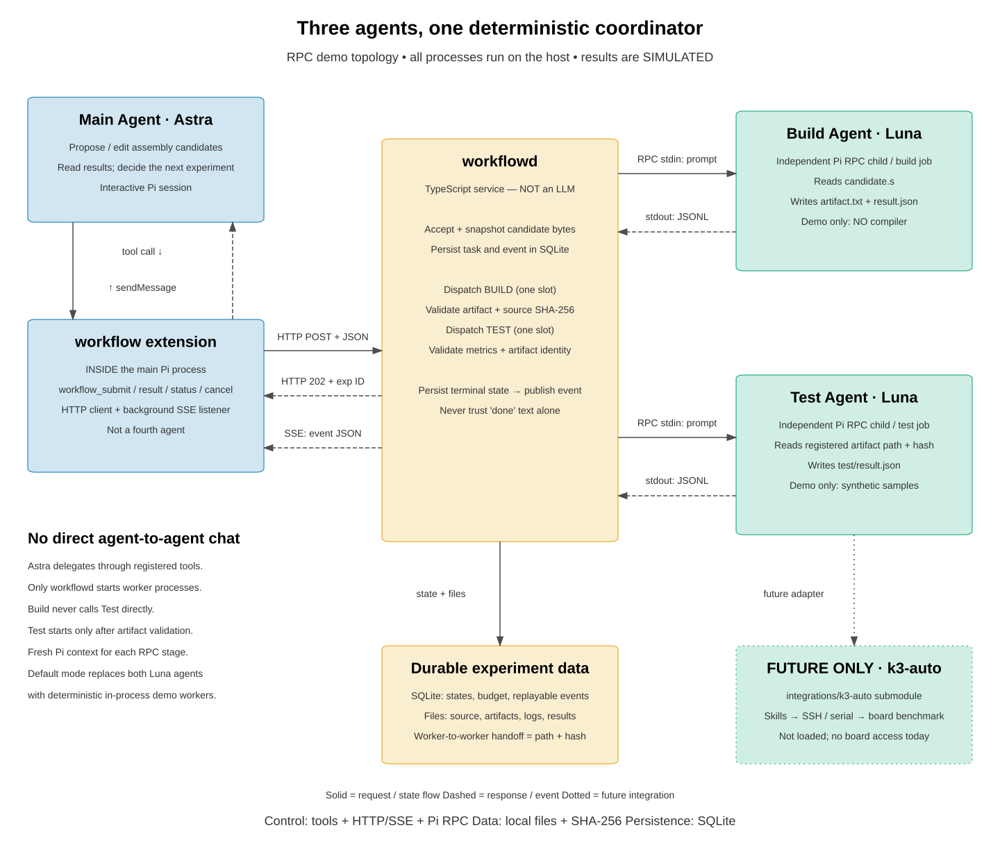

# K3 Agent Workflow

为 Pi 编写的轻量异步实验编排器：**Astra 主会话提出候选，独立 build/test Worker 执行任务，完成事件自动回到主会话**。

> 当前版本是 **hardware-free MVP**：验证任务编排，不编译汇编、不连接开发板，也不产生真实性能数据。所有结果均标记 `simulated: true`。不需要安装第三方 workflow 扩展、数据库服务或消息队列。

## 架构



- **主会话扩展**：四个模型工具、`/workflow` 命令、状态栏、异步完成消息。
- **后台服务**：本机 HTTP + bearer token、SQLite 任务/事件、固定 build→test 依赖、每 workflow 最多 5 次实验。
- **两个 Worker 槽位**：build 和 test 各一个，可以流水线重叠；同阶段不并发。默认是无模型的确定性模拟 Worker。
- **可选 Pi RPC Worker**：每个阶段启动一个独立 Pi 进程/上下文，用 JSONL 通信；必须等 `agent_settled`，之后还要校验实际产物。这个模式同样只做模拟，但会消耗模型 token。
- **SSE 完成通道**：扩展后台订阅，不让模型循环查询。支持事件重放、断线重连、去重和单订阅者控制。

图中的开发板接入仅是未来方向，**没有实现 SSH、串口、刷写或真实编译**。详细约定见 [设计说明](docs/design.md)。

## 1. 零安装跑 demo

要求 **Node.js 24+**。使用 Node 自带 TypeScript 类型擦除、SQLite、测试运行器，不需要 npm install、tsx、tsc 或构建步骤。

```bash
cd ~/workspace/k3-agent-workflow
node scripts/demo.ts
node --test tests/*.test.ts
```

Demo 会创建临时后台服务，提交候选，通过 SSE 等待结果，验证重复提交返回同一实验，最后清理临时目录。不会启动 Pi、调用模型、编译或访问硬件。

典型输出：

```text
Submitted exp-...; response returned before execution.
1: experiment.queued
2: build.started
3: build.succeeded
4: test.started
5: experiment.succeeded
PASS: submit → simulated build → simulated test → SSE completion ...
```

另外可以检查扩展入口与**本机已安装 Pi** 的实际导出是否兼容：

```bash
node scripts/check-extension.ts
```

此检查只加载扩展并注册工具/schema，不启动 Agent 会话、不调用模型。若 Pi 不在 PATH，设置 `PI_CLI_PATH=/absolute/path/to/pi`。

## 2. 在 Pi 中使用

### 终端 A：启动后台服务

```bash
cd ~/workspace/k3-agent-workflow
node src/cli.ts serve
```

默认地址 `http://127.0.0.1:43127`，持久化目录 `.workflow/`，认证令牌自动生成于 `.workflow/token`，权限为 `0600`。程序不会打印令牌内容。

自定义端口或状态目录：

```bash
node src/cli.ts serve --port 43127 --state /absolute/path/to/workflow-state
```

### 终端 B：加载主控扩展

在你要阅读/修改汇编的项目目录里启动 Pi：

```bash
export K3_WORKFLOW_URL=http://127.0.0.1:43127
export K3_WORKFLOW_TOKEN_FILE="$HOME/workspace/k3-agent-workflow/.workflow/token"

pi --model your-provider/astra \
  --extension "$HOME/workspace/k3-agent-workflow/extension/index.ts"
```

`your-provider/astra` 是占位符，请替换成 Pi 中已配置可用的模型。扩展由 Pi 加载，无需安装到全局目录；本项目不会修改你的 `~/.pi` 配置。

在 Pi 内执行：

```text
/workflow attach asm-demo
```

等待状态栏显示 `connected`，然后对主 Agent 说：

```text
请调用 workflow_submit 提交一次模拟实验：
key 使用 candidate-001，candidate 使用 "ret\n"，
hypothesis 为“验证异步链路，不评估真实性能”。
提交后停止查询，等待 workflow 完成消息。
```

默认完成消息会进入会话，但**不会自动调用模型继续推理**。如需自动闭环，由你显式开启：

```text
/workflow auto on
```

再告诉主 Agent：“收到结果后分析；本次只尝试 2 个候选，不将模拟数字当作优化收益”。编排器另有每 workflow 5 个实验的硬上限，包括失败和取消；重复提交不占新额度。自动模式可能消耗模型 token。

### 常用命令

| 命令 | 行为 |
|---|---|
| `/workflow attach NAME` | 绑定/重连一个 workflow，自动续轮重置为 OFF |
| `/workflow status` | 显示任务状态 |
| `/workflow auto on` / `off` | 控制完成通知是否触发主 Agent 续轮 |
| `/workflow pause` | 停止后续派发，并关闭自动续轮；当前任务继续 |
| `/workflow resume` | 恢复派发，不自动打开续轮 |
| `/workflow cancel EXP_ID` | 请求取消，等待运行中的 Worker 真正退出 |
| `/workflow detach` | 断开主会话，后台任务继续 |

模型工具：`workflow_submit`、`workflow_status`、`workflow_result`、`workflow_cancel`。

关闭 Pi 不会关闭后台服务；重新进入会话后显式 attach，扩展会按该会话分支中的游标补收事件。切换会话/分支会停止旧订阅。一个 workflow 同时只允许一个事件订阅者；另一个主会话想接管时，先 detach 旧会话。

**暂停不会撤销已经排入 Pi 的 follow-up，也不能终止已经开始的模型推理。** 必要时同时在 Pi 中停止当前运行。异步提交一旦服务端接收，取消工具调用本身也不会撤销后台任务，需调用 `workflow_cancel`。

## 3. 可选：使用真正的 Pi 子进程（仍然是模拟任务）

先关闭原后台服务，再运行：

```bash
node src/cli.ts serve --rpc-demo-model your-provider/luna
```

前提：Pi 在 PATH，Luna 模型已配置认证。主会话仍使用 Astra，build/test 阶段分别使用 Luna。Worker 每任务新建进程，避免跨候选上下文污染。

此模式：

- 给子进程发送真实 Pi RPC prompt；记录 JSONL 与 stderr；
- 仅开放 `read,write`，禁用发现的扩展、技能、模板和项目受信资源；
- 保留正常的全局上下文规则；不向 Worker 传递主控 token 环境变量；
- 要求生成模拟 artifact 和严格的 `result.json`，不提供 bash 工具；
- 60 秒超时、输出大小限制、进程退出检测、取消与进程组清理。

**本轮自动验证覆盖的是假 Pi 子进程的真实 JSONL 通信；没有调用真实模型。** 使用真实模型的手动 smoke test 需要你明确启动上述模式。不要据此认为已经完成真实编译/板测集成。

## 数据、日志与恢复

```text
.workflow/                    # gitignored，不提交令牌/实验数据
├── token
├── daemon.lock               # 单后台进程保护，记录 PID
├── state.sqlite              # SQLite WAL：任务、事件、workflow
└── runs/exp-.../
    ├── candidate.s           # 提交时固化的字节，SHA-256 绑定
    ├── manifest.json         # 初始请求清单；当前状态以 SQLite 为准
    ├── build/
    │   ├── artifact.txt      # 非可执行的模拟产物
    │   ├── result.json
    │   └── worker.log        # 默认模拟模式
    └── test/
        └── result.json
```

RPC 模式在各阶段目录增加 `rpc.jsonl` 和 `stderr.log`。通过 `workflow_result` 得到目录、产物哈希、结构化结果与错误。

- 重复提交必须使用相同 key 和完全相同 payload，否则返回 409。
- 构建失败不会派发 test；产物哈希、数据格式、正确性检查失败不能算成功。
- 正常关停会取消当前模拟任务。异常崩溃留下的 `running` 任务在重启时转为 `needs_attention`，**不自动重试**；排队任务可恢复。
- 崩溃可能留下 `daemon.lock`：先检查记录的 PID、确认旧 Worker 均已退出，再手动删除陈旧锁并重启。不能仅因连接断开就启动第二个调度器。
- 完成消息只有进入 Pi transcript 后才确认持久化投递游标。服务端状态和 Pi transcript 无法跨系统原子提交，仍可能重放；恢复后按实验 ID 查询事实，重复提交使用原 key。

## 预留集成：k3-auto submodule

[`integrations/k3-auto`](integrations/k3-auto) 引用 [liulog/k3-auto](https://github.com/liulog/k3-auto)，预留给未来 **测试 Pi Agent** 使用，用于开发板连接、benchmark 执行及相关 skill 集成。

当前仅作为固定提交版本的 Git submodule 保存：**不自动加载 skill、不执行其中脚本、不连接开发板，也不影响现有模拟 workflow**。真实接入和权限边界将在后续扩充。

首次克隆时可同时获取：

```bash
git clone --recurse-submodules git@github.com:liulog/k3-agent-workflow.git
```

已有克隆可获取主仓库锁定的版本：

```bash
git submodule update --init --recursive
```

运行当前 demo 不需要初始化此 submodule。未来更新其版本时，应审阅上游变更，再单独提交主仓库中的 submodule 指针，不自动跟随上游最新提交。

## 当前边界

这不是生产级硬件控制系统，也不是 OS 安全沙箱：同一用户的 Pi `read,write` 仍有该用户的文件权限。HTTP token 防止无授权的本机请求，不隔离同用户 Worker。

当前不支持：真实构建配置、完整 Git 仓库快照、多板资源租约、远程 Worker、自动重试、产物 GC、预算在线修改、成本/时间总预算、跨机器认证。

后续接入真实编译/开发板时，应增加受控脚本与权限授权、commit/worktree 快照、严格产物 contract、设备租约、部署版本确认、安全取消与故障隔离。不能直接把当前 demo 的“杀进程即取消”用于刷写。

## 测试范围

当前自动测试覆盖：

- 状态流转、依赖、单槽互斥、暂停/恢复、排队与运行中取消；
- 幂等冲突、5 次实验预算、重启恢复、workflow 隔离；
- 源码/产物篡改、符号链接、错误 identity、错误指标和正确性失败；
- HTTP token、Origin 拒绝、单服务锁、SSE 补收、订阅者排他；
- RPC prompt 拒绝、损坏 JSONL、Unicode 分隔符、提前 `agent_end`、模型报错、超时、进程消失、取消；
- 扩展工具注册、完成通知、默认不开续轮、显式 follow-up、投递游标、detach 清理。

这是运行时验证，不是 TypeScript 静态类型检查。本阶段没有运行 tsc、打包或安装依赖。

## 架构图源码

使用本地 `architecture-drawer` skill 生成、评估 SVG，并将其复制到 `docs/architecture.svg` 供 README 展示。

```bash
PYTHONDONTWRITEBYTECODE=1 python3 output/20260603_architecture/gen_architecture.py
```

默认查找 `~/.pi/agent/skills/architecture-drawer`，可用 `ARCHITECTURE_DRAWER_HOME` 覆盖。

- [生成脚本](output/20260603_architecture/gen_architecture.py)
- [设计契约](output/20260603_architecture/brief.json)
- [图形验证报告](output/20260603_architecture/validation.txt)

生成目录中的 SVG/PNG/PPTX 是可再生文件，不纳入 Git；README 使用的 SVG 单独提交。PNG 可使用本机 ImageMagick 回退。可编辑 PPTX 依赖 `python-pptx`；当前机器未安装，因此没有生成 PPTX，也没有擅自安装依赖。
