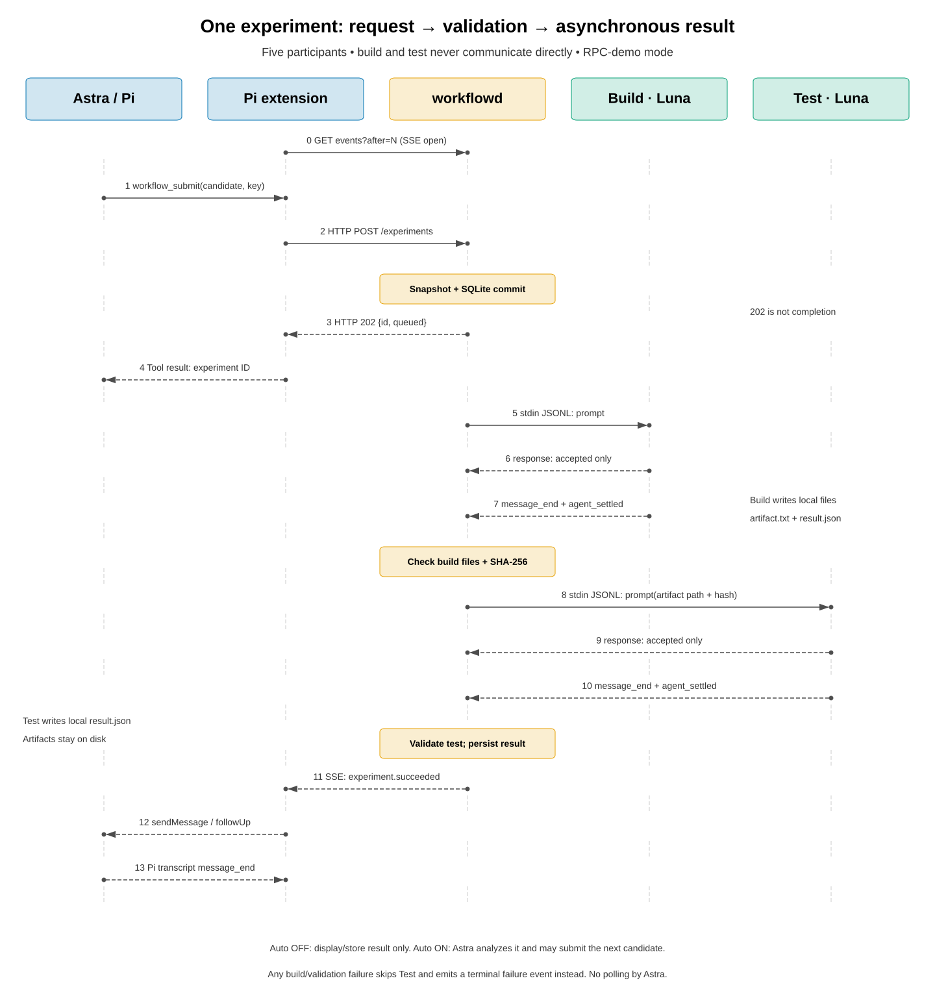

# K3 Agent Workflow


[查看高清总览](assets/system-overview.png)。此图用于理解组件关系；其中“分析结果”是主会话的行为，不是独立服务。HTTP 请求/202 响应及 SSE 的实际端点均为 **workflow 扩展 ↔ workflowd**，具体方向以[协议图](docs/architecture.svg)和[时序图](docs/sequence.svg)为准。图中的 Luna 子进程对应可选 RPC demo 模式，默认模式不启动它们。

为 Pi 编写的轻量异步实验编排器：**Astra 主会话提出候选，独立 build/test Worker 执行任务，完成事件自动回到主会话**。

> 当前版本是 **hardware-free MVP**：不编译、不连接开发板、不产生真实性能数据。默认 `demo` 返回 `simulated: true`；新增 `linux-k3-plan` 返回 `mode: "plan-only"`，只生成计划，没有跑分。无需安装第三方 workflow 框架。

## 新增：Build Luna → k3-auto/Test Luna 只读预演

已用真实 `openai-codex/gpt-5.6-luna` 完成两个独立 Agent 的计划交接：Build 阅读 Linux 构建资料，Test 显式加载三个 k3-auto skill 并读取 Build 计划；全程只有受限 `read` 工具。**未运行编译、k3ctl、SSH、上下电或 benchmark。**

```bash
# planning.local.json 参照根目录 planning.example.json 配置，本机文件不入 Git
node src/cli.ts check-plan --plan-config planning.local.json          # 静态检查，不调用模型
node scripts/plan-experiment.ts --config planning.local.json         # 默认假 Pi，不调用模型
node scripts/plan-experiment.ts --config planning.local.json --real-models  # 显式调用真实模型，仅规划
```

当前已有 PNG/SVG 展示原 `demo` 链路；新模式仍沿用相同的 HTTP→RPC→SSE 拓扑，但交接的是编译计划而不是模拟固件，并为 Test 显式加载 skill 的只读快照。

完整说明与主 Agent 部署步骤：[只读预演指南](docs/plan-only.md)。真实实验的成功/失败经过和证据：[MVP 实验报告](docs/experiments/linux-k3-plan-smoke.md)。

## workflowd 是什么？

**`workflowd` 是本项目自己编写的 TypeScript 后台编排服务，不是第三方产品，也不是 Agent。** 名字中的 `d` 表示 daemon（后台服务）；当前没有同名独立可执行文件，实际通过 `node src/cli.ts serve` 启动。

| 部分 | 来源 | 作用 |
|---|---|---|
| `workflowd` 的调度逻辑 | 本项目自写：`src/engine.ts` | 固定 build→test 状态机、并发槽位、产物校验 |
| HTTP / SSE 服务 | 本项目自写：`src/server.ts`，使用 Node 内置 HTTP 模块 | 接收任务、返回 ID、推送事件 |
| 持久化 | 本项目自写：`src/store.ts`，使用 Node 内置 `node:sqlite` 接口及 SQLite | 保存实验状态和事件 |
| Pi Worker 接入 | 本项目自写：`src/rpc-worker.ts`，使用 Pi 已有的 RPC 协议 | 启动 Pi 子进程，通过 stdin/stdout JSONL 通信 |
| 主控扩展 | 本项目自写：`extension/`，使用 Pi 的扩展 API | 给 Astra 提供工具，并将结果送回会话 |
| Agent 运行时 | 已有的 Pi | 模型调用、工具执行、会话管理 |

因此当前组合是 **“已有 Pi + 自写轻量编排层 + Node/SQLite 基础设施”**，没有使用 Temporal、Prefect、LangGraph 等工作流框架。前面讨论这些工具是在评估未来替换自写调度内核的可能性，并非它们已经接入。

## 三个 Agent 如何协作

**不是三个 Agent 相互聊天，而是 Astra 发起实验，确定性的编排器依次委派给编译 Luna、测试 Luna，再将经过校验的结果推回 Astra。** 编译 Agent 不直接调用测试 Agent，也不互相传递会话历史。

### 图一：角色、进程边界和通信链路

[查看完整协作图](docs/architecture.svg)


> 图中展示 **可选 Pi RPC demo 模式**。默认启动时，两个 Luna 子进程替换成无模型的模拟 Worker。两种模式目前均不编译、不连接开发板。所有 Pi 进程运行在主机上，不在开发板上运行。

| 角色 | 职责 | 边界 |
|---|---|---|
| 主 Agent：Astra | 修改/提出汇编候选，提交实验，分析返回结果，决定下一轮 | 不直接给子 Agent 发 RPC，不直接控制开发板 |
| 主控扩展 | 把工具调用转成 HTTP；订阅 SSE，把结果放回 Pi 会话 | 在 Astra 的 Pi 进程内，**不是额外 Agent** |
| `workflowd` | 持久化任务，安排 build→test，校验产物和结果，发布事件 | TypeScript 程序，**不是 LLM**；只有它调度 Worker |
| 编译 Agent：Luna | 接受 build 阶段委派；当前生成模拟 artifact 和结果文件 | 每任务独立 Pi RPC 子进程，单 build 槽位 |
| 测试 Agent：Luna | 接收已登记的产物路径/哈希；当前生成模拟测试结果 | 每任务独立 Pi RPC 子进程，单 test 槽位 |
| `k3-auto` | 给测试 Agent 提供板测相关 skill / 工具 | demo 不加载；plan-only 显式加载只读 skill 快照；真实板测尚未接入 |

### 通信协议：每条链路传什么

| 链路 | 协议/接口 | 传递内容 |
|---|---|---|
| Astra → 主控扩展 | Pi 本地工具调用 | `workflow_submit({key,candidate,hypothesis})`；查询/取消也通过工具 |
| 扩展 → `workflowd` | 本机 HTTP + JSON，bearer token | `POST /workflows/:name/experiments`；返回 **202 + 实验 ID** |
| `workflowd` → 编译/测试 Luna | Pi RPC：stdin 上逐行 JSON | `{"id":"job","type":"prompt","message":"阶段任务与产物契约…"}` |
| Luna → `workflowd` | Pi RPC：stdout 上逐行 JSON | 接受响应、消息/工具事件、`message_end`、`agent_settled`；stderr 单独记录 |
| 编译阶段 → 测试阶段 | **不是网络聊天；由编排器交接本地文件引用** | 构建产物路径 + SHA-256；测试只在构建产物校验通过后派发 |
| Worker → 编排器的业务结果 | 阶段目录中的 `result.json` 和产物文件 | 结构化结果由编排器校验；不能用 Agent 的一句“完成了”替代 |
| `workflowd` → 扩展 | SSE，`GET /workflows/:name/events?after=N` | 进度、终态事件 JSON；带事件 ID，支持断线重放 |
| 扩展 → Astra/Pi 会话 | `pi.sendMessage`，`deliverAs: "followUp"` | 完成事件进入会话；只有开启 auto 才触发模型续轮 |
| 测试 Agent → 开发板（未来） | 计划通过 `k3-auto` skill/工具使用 SSH、串口等 | 尚未实现，不属于当前 RPC/SSE 链路 |

### 图二：一次实验的完整时序

[查看完整时序图](docs/sequence.svg)



1. 扩展先建立 SSE 订阅。Astra 提交候选，服务固化源码并登记实验，立即返回 ID；Astra 不需要反复轮询。
2. 编排器派发 build。**RPC prompt accepted 只表示已接受任务**；等到 `agent_settled` 后，还要确认正常结束、检查结果文件和哈希。
3. 校验通过才派发 test，并传递明确的产物身份。构建失败则跳过 test，直接产生失败事件。
4. 测试结束后，编排器校验指标、正确性和产物身份，持久化终态，再经 SSE 推送结果。
5. 扩展将结果送入主会话。auto OFF 仅显示/保存；auto ON 才让 Astra 继续分析并决定是否提交下一轮。图末的 `message_end` 是 **Pi runtime 的 transcript 事件**，不是 Astra 额外调用模型确认。

**三个“完成”不能混淆：HTTP 202 ≠ RPC accepted ≠ 实验成功。** `agent_settled` 也只说明 Agent 不会再自动继续，业务成功仍需编排器校验。

同一个实验必须 build→test 串行；不同实验可以 build(N+1) 与 test(N) 重叠。build/test 各一个槽位，测试任务全局串行；这尚不等同于未来真实开发板的设备锁与故障恢复机制。

详细消息示例与故障语义见 [通信协议说明](docs/communication.md)，状态机和实现约定见 [设计说明](docs/design.md)。

## 1. 零安装跑 demo

要求 **Node.js 24+**。使用 Node 自带 TypeScript 类型擦除、SQLite、测试运行器，不需要 npm install、tsx、tsc 或构建步骤。

```bash
cd ~/workspace/k3-agent-workflow
node scripts/demo.ts
node --test tests/*.test.ts
```

Demo 会创建临时后台服务，提交候选，通过 SSE 等待结果，验证重复提交返回同一实验，最后清理临时目录。不会启动 Pi、调用模型、编译或访问硬件。

典型输出：

```text
Submitted exp-...; response returned before execution.
1: experiment.queued
2: build.started
3: build.succeeded
4: test.started
5: experiment.succeeded
PASS: submit → simulated build → simulated test → SSE completion ...
```

另外可以检查扩展入口与**本机已安装 Pi** 的实际导出是否兼容：

```bash
node scripts/check-extension.ts
```

此检查只加载扩展并注册工具/schema，不启动 Agent 会话、不调用模型。若 Pi 不在 PATH，设置 `PI_CLI_PATH=/absolute/path/to/pi`。

## 2. 在 Pi 中使用

### 终端 A：启动后台服务

```bash
cd ~/workspace/k3-agent-workflow
node src/cli.ts serve
```

默认地址 `http://127.0.0.1:43127`，持久化目录 `.workflow/`，认证令牌自动生成于 `.workflow/token`，权限为 `0600`。程序不会打印令牌内容。

自定义端口或状态目录：

```bash
node src/cli.ts serve --port 43127 --state /absolute/path/to/workflow-state
```

### 终端 B：加载主控扩展

在你要阅读/修改汇编的项目目录里启动 Pi：

```bash
export K3_WORKFLOW_URL=http://127.0.0.1:43127
export K3_WORKFLOW_TOKEN_FILE="$HOME/workspace/k3-agent-workflow/.workflow/token"

pi --model your-provider/astra \
  --extension "$HOME/workspace/k3-agent-workflow/extension/index.ts"
```

`your-provider/astra` 是占位符，请替换成 Pi 中已配置可用的模型。扩展由 Pi 加载，无需安装到全局目录；本项目不会修改你的 `~/.pi` 配置。

在 Pi 内执行：

```text
/workflow attach asm-demo
```

等待状态栏显示 `connected`，然后对主 Agent 说：

```text
请调用 workflow_submit 提交一次模拟实验：
key 使用 candidate-001，candidate 使用 "ret\n"，
hypothesis 为“验证异步链路，不评估真实性能”。
提交后停止查询，等待 workflow 完成消息。
```

默认完成消息会进入会话，但**不会自动调用模型继续推理**。如需自动闭环，由你显式开启：

```text
/workflow auto on
```

再告诉主 Agent：“收到结果后分析；本次只尝试 2 个候选，不将模拟数字当作优化收益”。编排器另有每 workflow 5 个实验的硬上限，包括失败和取消；重复提交不占新额度。自动模式可能消耗模型 token。

### 常用命令

| 命令 | 行为 |
|---|---|
| `/workflow attach NAME` | 绑定/重连一个 workflow，自动续轮重置为 OFF |
| `/workflow status` | 显示任务状态 |
| `/workflow auto on` / `off` | 控制完成通知是否触发主 Agent 续轮 |
| `/workflow pause` | 停止后续派发，并关闭自动续轮；当前任务继续 |
| `/workflow resume` | 恢复派发，不自动打开续轮 |
| `/workflow cancel EXP_ID` | 请求取消，等待运行中的 Worker 真正退出 |
| `/workflow detach` | 断开主会话，后台任务继续 |

模型工具：`workflow_submit`（原模拟任务）、`workflow_plan_linux`（Linux→k3-auto 只读预演）、`workflow_status`、`workflow_result`、`workflow_cancel`。

关闭 Pi 不会关闭后台服务；重新进入会话后显式 attach，扩展会按该会话分支中的游标补收事件。切换会话/分支会停止旧订阅。一个 workflow 同时只允许一个事件订阅者；另一个主会话想接管时，先 detach 旧会话。

**暂停不会撤销已经排入 Pi 的 follow-up，也不能终止已经开始的模型推理。** 必要时同时在 Pi 中停止当前运行。异步提交一旦服务端接收，取消工具调用本身也不会撤销后台任务，需调用 `workflow_cancel`。

## 3. 可选：使用真正的 Pi 子进程（仍然是模拟任务）

先关闭原后台服务，再运行：

```bash
node src/cli.ts serve --rpc-demo-model your-provider/luna
```

前提：Pi 在 PATH，Luna 模型已配置认证。主会话仍使用 Astra，build/test 阶段分别使用 Luna。Worker 每任务新建进程，避免跨候选上下文污染。

此模式：

- 给子进程发送真实 Pi RPC prompt；记录 JSONL 与 stderr；
- 仅开放 `read,write`，禁用发现的扩展、技能、模板和项目受信资源；
- 保留正常的全局上下文规则；不向 Worker 传递主控 token 环境变量；
- 要求生成模拟 artifact 和严格的 `result.json`，不提供 bash 工具；
- 60 秒超时、输出大小限制、进程退出检测、取消与进程组清理。

本节的原 `demo` 模式通过假 Pi 子进程做协议回归。新增 `linux-k3-plan` 模式另已完成真实 Luna 只读预演，见 [实验报告](docs/experiments/linux-k3-plan-smoke.md)。两者都不代表已经完成真实编译/板测集成。

## 数据、日志与恢复

```text
.workflow/                    # gitignored，不提交令牌/实验数据
├── token
├── daemon.lock               # 单后台进程保护，记录 PID
├── state.sqlite              # SQLite WAL：任务、事件、workflow
└── runs/exp-.../
    ├── candidate.s           # 提交时固化的字节，SHA-256 绑定
    ├── manifest.json         # 初始请求清单；当前状态以 SQLite 为准
    ├── build/
    │   ├── artifact.txt      # 非可执行的模拟产物
    │   ├── result.json
    │   └── worker.log        # 默认模拟模式
    └── test/
        └── result.json
```

RPC 模式在各阶段目录增加 `rpc.jsonl` 和 `stderr.log`。通过 `workflow_result` 得到目录、产物哈希、结构化结果与错误。

- 重复提交必须使用相同 key 和完全相同 payload，否则返回 409。
- 构建失败不会派发 test；产物哈希、数据格式、正确性检查失败不能算成功。
- 正常关停会取消当前模拟任务。异常崩溃留下的 `running` 任务在重启时转为 `needs_attention`，**不自动重试**；排队任务可恢复。
- 崩溃可能留下 `daemon.lock`：先检查记录的 PID、确认旧 Worker 均已退出，再手动删除陈旧锁并重启。不能仅因连接断开就启动第二个调度器。
- 完成消息只有进入 Pi transcript 后才确认持久化投递游标。服务端状态和 Pi transcript 无法跨系统原子提交，仍可能重放；恢复后按实验 ID 查询事实，重复提交使用原 key。

## 预留集成：k3-auto submodule

[`integrations/k3-auto`](integrations/k3-auto) 引用 [liulog/k3-auto](https://github.com/liulog/k3-auto)，预留给未来 **测试 Pi Agent** 使用，用于开发板连接、benchmark 执行及相关 skill 集成。

submodule 固定在已登记提交。默认 demo 不加载它；`linux-k3-plan` 将 `k3-benchmark`、`k3-lab`、`k3-status` 固化为快照，并通过显式 `--skill` 提供给 Test Luna。**只允许阅读，不执行其中脚本、不连接开发板**；真实执行与权限边界仍待扩充。

首次克隆时可同时获取：

```bash
git clone --recurse-submodules git@github.com:liulog/k3-agent-workflow.git
```

已有克隆可获取主仓库锁定的版本：

```bash
git submodule update --init --recursive
```

运行原 demo 不需要初始化此 submodule；真实资料的 plan-only 预演需要初始化它。未来更新其版本时，应审阅上游变更，再单独提交主仓库中的 submodule 指针，不自动跟随上游最新提交。

## 当前边界

这不是生产级硬件控制系统，也不是 OS 安全沙箱：原 demo Worker 的 `read,write` 仍有该用户的文件权限；plan-only 另以受限 `read` 工具强制执行资料白名单，但不隔离恶意同用户进程或 Pi runtime。HTTP token 防止无授权的本机请求，不代替操作系统隔离。

当前不支持：真实构建配置、完整 Git 仓库快照、多板资源租约、远程 Worker、自动重试、产物 GC、预算在线修改、成本/时间总预算、跨机器认证。

后续接入真实编译/开发板时，应增加受控脚本与权限授权、commit/worktree 快照、严格产物 contract、设备租约、部署版本确认、安全取消与故障隔离。不能直接把当前 demo 的“杀进程即取消”用于刷写。

## 测试范围

当前自动测试覆盖：

- 状态流转、依赖、单槽互斥、暂停/恢复、排队与运行中取消；
- 幂等冲突、5 次实验预算、重启恢复、workflow 隔离；
- 源码/产物篡改、符号链接、错误 identity、错误指标和正确性失败；
- HTTP token、Origin 拒绝、单服务锁、SSE 补收、订阅者排他；
- RPC prompt 拒绝、损坏 JSONL、Unicode 分隔符、提前 `agent_end`、模型报错、超时、进程消失、取消；
- 扩展工具注册、完成通知、默认不开续轮、显式 follow-up、投递游标、detach 清理；
- plan-only 配置、技能快照、只读工具、完整分页读取证据、计划哈希交接、禁止执行字段、读取拼写纠正与失败关闭。

当前离线自动测试 **46 项通过**；另已做真实双 Luna 预演（人工启动，不放入默认测试）。

这是运行时验证，不是 TypeScript 静态类型检查。本阶段没有运行 tsc、打包或安装依赖。

## 架构图源码

使用本地 `architecture-drawer` skill 生成、评估两张 SVG，并复制到 `docs/architecture.svg` 与 `docs/sequence.svg` 供 README 展示。

```bash
PYTHONDONTWRITEBYTECODE=1 python3 output/20260603_architecture/gen_architecture.py
```

默认查找 `~/.pi/agent/skills/architecture-drawer`，可用 `ARCHITECTURE_DRAWER_HOME` 覆盖。

- [生成脚本](output/20260603_architecture/gen_architecture.py)
- 设计契约：[协作图](output/20260603_architecture/brief.json) / [时序图](output/20260603_architecture/sequence-brief.json)
- 图形验证报告：[协作图](output/20260603_architecture/validation.txt) / [时序图](output/20260603_architecture/sequence-validation.txt)

生成目录中的 SVG/PNG/PPTX 是可再生文件，不纳入 Git；README 使用的 SVG 单独提交。PNG 可使用本机 ImageMagick 回退。可编辑 PPTX 依赖 `python-pptx`；当前机器未安装，因此没有生成 PPTX，也没有擅自安装依赖。
